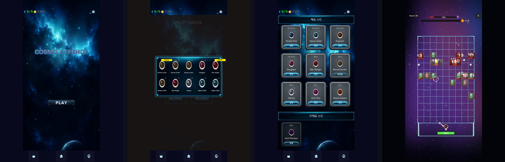
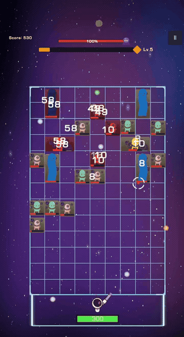
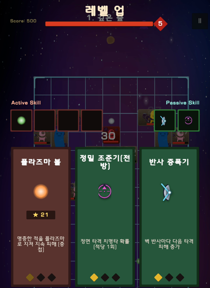
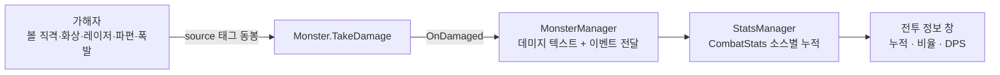
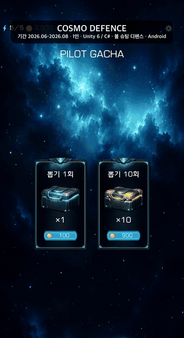

# 코스모 디펜스 (Cosmo Defence)

[](https://github.com/pmj9384/CosmoDefence/actions/workflows/test.yml)


> **볼을 쏘아 튕기며 내려오는 몬스터를 막는 우주 테마 핀볼 디펜스**<br>
> Unity 6000.3.10 · Android(세로) · 2026.06.30 ~ 07.28 (4주) · 1인 클라이언트 전체

<p align="center">
  
</p>

몬스터를 향해 볼을 쏘아 튕기며 싸우는 핀볼 디펜스입니다. 처음 7일은 원작(통통 디펜스: 핀볼 마스터) 1스테이지의 핵심 루프(발사, 물리 반사 전투, 레벨업 3택지, 스킬 성장, 웨이브, 결과 화면)를 재현하는 채용 과제였고, 제출 후에는 과제를 넘어서는 게 다음 단계라고 판단해 우주 테마 리스킨, 무한 모드와 보스, 로비·가챠·스킨의 아웃게임을 얹어 COSMO DEFENCE로 확장했습니다. 과제에서 출발한 이력을 지우지 않은 이유는, 원작 관찰을 구현의 기준으로 삼는 방식이 이 프로젝트 설계 판단의 뿌리이기 때문입니다.

**목차** — [실행 방법](#1-실행-방법) · [주요 구현 내용](#2-주요-구현-내용) · [검증을 재현하는 방법](#3-검증을-재현하는-방법) · [과제 이후 확장](#4-과제-이후-확장) · [AI 활용](#5-ai-활용) · [남겨둔 것과 그 이유](#6-남겨둔-것과-그-이유) · [프로젝트 구조](#7-프로젝트-구조)

---

## 1. 실행 방법

### Unity 에디터
프로젝트를 Unity Hub에 추가하고 Unity 6000.3.10으로 열어 `Assets/Scenes/OutGameLoadingScene.unity`를 Play 하면 됩니다. 씬은 부팅 로딩 → 로비 → 인게임 세 개(`OutGameLoadingScene` → `LobbyScene` → `InGameScene`)로 나뉘어 있고, 스킨 스프라이트 선로드(Addressables)를 부팅 씬이 담당하므로 이 씬부터 시작하는 것을 기준으로 합니다. (다른 씬에서 시작해도 스킨은 사용 시점 로드로 폴백해 동작합니다). 첫 열기는 Library 재생성 때문에 기기에 따라 3~10분 걸립니다

### APK 빌드
에디터 메뉴 Tools → Build Android APK 클릭 한 번으로 빌드됩니다. 세로 고정·IL2CPP·ARM64/ARMv7 설정을 빌드 스크립트(`Assets/Editor/BuildScript.cs`)가 매번 강제해서, 설정을 빠뜨린 빌드가 나올 수 없게 만들었습니다. 에디터에 Android Build Support 모듈이 필요하고, 결과물은 약 84MB입니다.

### 조작과 규칙
드래그(터치)로 조준하면 점선 경로와 끝점 레티클로 반사 궤적이 미리 보입니다. 발사는 자동입니다. 보유한 볼이 회수되는 대로 다시 나갑니다.

몬스터는 화면 위에서 한 줄씩 내려옵니다. 바닥까지 내려온 몬스터는 플레이어에게 돌진해 체력을 깎고, 체력이 다 떨어지면 실패입니다. 스테이지 클리어는 없습니다. 20웨이브마다 보스가 나오고, 보스를 잡으면 다음 구간이 이어지는 무한 모드입니다. 인게임 입장은 로비에서 스태미나(최대 5) 1을 소모하며, 우상단 ⏸ 일시정지 안에서 전투 정보(볼별 통계)를 볼 수 있습니다.

---

## 2. 주요 구현 내용

### 원작 관찰을 구현의 기준으로 삼았습니다

기획서에 없는 부분은 추측 대신 원작 스토어 영상과 실플레이를 관찰해 문서화하고, 그것을 구현의 기준으로 사용했습니다. 이 과정에서 처음 설계를 두 번 크게 뒤집었습니다.

발사 모델은 처음에 쿨다운 기반으로 만들었는데, 원작을 다시 보니 보유한 볼 하나하나가 개체였고 "먼저 회수된 볼부터 재발사"되고 있었습니다. 그래서 만든 코드를 폐기하고 볼 인벤토리(큐)로 재설계했습니다. 쿨다운이 아니라 볼이 돌아와야 다시 쏘는 구조라, 회수 순서가 곧 발사 순서인 큐에 규칙이 그대로 담깁니다. `BallInventory`는 순수 C# Queue로, 레벨과 데미지를 발사 시점에 조회하기 때문에 비행 중 레벨업은 다음 발사부터 반영됩니다.

웨이브도 "전멸하면 다음 묶음 스폰"으로 만들었다가, 관찰해 보니 원작은 시작에 몇 줄을 깔고 이후 한 줄씩 계속 이어지는 행 컨베이어였습니다. 다음 줄이 나오는 박자를 시간이 아니라 "앞 줄이 한 칸 내려온 거리"로 정의했습니다. 이렇게 하면 하강 속도를 어떻게 튜닝해도 줄들이 격자 간격을 유지하고, 세로 2칸 몬스터(드리프터 1×2 등 멀티셀)가 윗줄 자리를 선점하는 것도 자연스럽게 성립합니다. 행 간격은 CellHeight ÷ 하강 속도로 `WaveManager`가 자동 계산합니다.

몬스터를 놓을 자리는 전부 `FieldManager`의 격자 9×13이 정합니다. 초기에는 화면 좌표를 눈대중 계측으로 잡다가 세 번 연속 어긋난 뒤, 위치를 아는 주체를 한 곳으로 못박고 모든 배치를 `CellToWorld(행, 열)` 호출로 바꿨습니다. 좌표 버그가 "어느 계측이 틀렸나"에서 "어느 셀을 지목했나"의 문제로 좁혀집니다.

### 스테이지 클리어를 없애고 무한 모드로 바꿨습니다

과제 버전은 전투 행 20개를 처리하면 클리어였지만, 확장하면서 회차 플레이의 축을 "얼마나 버티는가"로 옮겼습니다. 행 패턴은 그대로 `StagePattern.csv`에 두고, 스폰 인덱스를 행 수로 나눈 나머지(`nextRow % Rows.Count`)로 패턴을 순환시킵니다. 몬스터 HP는 시작부터 세어 온 행 번호를 기준으로 오르기 때문에, 패턴이 한 바퀴 돌 때마다 체력이 저절로 더 올라갑니다.

20웨이브마다 2×2 보스가 나옵니다. WARNING 배너와 경보음으로 예고한 뒤 스폰되고, 등장 후 4초간 제자리에 머물러(entryHold) 잔여 행을 정리할 시간을 줍니다. 보스는 일반 몬스터와 달리 바닥에서 돌진하지 않고 정지해 주기 공격과 잡몹 소환을 하며, 그동안 상단 HUD의 진행 게이지가 보스 전용 HP바로 바뀝니다. 스폰 위치는 격자 칸에 맞추면 홀수 열 필드에서 반 칸 쏠리는 문제가 있어, 중앙 열 좌표에 보스 중심을 직접 얹는 방식으로 풀었습니다.

<p align="center">

</p>

### 규칙은 순수 C#으로 분리하고 테스트를 붙였습니다

데미지 공식, 카드 뽑기 규칙, 볼 회수 순서, 전투 통계, 행 패턴 검증 같은 "게임 규칙"은 엔진에 의존하지 않는 순수 C# 어셈블리(`TongTong.Core`)로 분리하고 EditMode 테스트 56개로 커버했습니다. 치명타 조합이나 파서가 형식이 어긋난 CSV 행을 거르는 동작 같은 것들은 Play 모드로 재현하기가 사실상 불가능해서, 테스트가 유일하게 현실적인 검증 수단이라고 판단했습니다. 실제로 스킬 테이블의 형식이 어긋난 행과 딕셔너리 null 키 크래시를 테스트와 엄격한 파서가 잡아줬습니다. 테스트는 GitHub Actions(GameCI)에서 push마다 자동으로 돕니다.

스킬은 액티브 볼 5종 + 패시브 5종의 10종 × 3레벨이고, 온히트 행동(화상·빙결·레이저·분열·폭발)은 `IOnHitEffect` 구현 5개로 분리해 볼 본체가 효과의 내용을 모르게 했습니다.

<p align="center">

</p>

```
TongTong.Core (asmdef, 엔진 무의존)
  SkillTableParser · DamageCalculator · SkillDraft · PlayerLevel
  BallInventory · CombatStats · StagePattern  ← 전부 EditMode 테스트 대상
```

### 매니저는 싱글톤 대신 주입으로 연결했습니다

싱글톤은 의존성이 코드 어디에나 숨어들어 추적이 어려워진다고 판단해, 중앙 GameManager(상태 머신)가 씬의 "Manager" 태그 오브젝트를 `RegisterManager<T>`로 등록하고 프로퍼티로 들고 주입하는 방식을 썼습니다. "누가 무엇을 아는가"가 한 곳에 명시되고, 매니저 간 통신은 C# 이벤트로 처리합니다. 볼·몬스터 같은 프리팹 인스턴스는 매니저의 존재를 모른 채 값을 받고 이벤트만 발행합니다.

이 구조가 가장 잘 드러난 곳이 전투 정보 창입니다. 원작 관찰 중 패시브(폭발)의 데미지까지 스킬별로 집계되는 걸 발견하고, 모든 데미지에 "누가 때렸는지" 소스 태그를 실어 보내도록 파이프라인을 만들었습니다. 볼 직격·화상 틱·레이저·파편·폭발 다섯 곳이 각자 자기 정체를 태깅하면, 집계 전담 매니저(StatsManager)가 스킬별로 모으고 UI는 그 창구 하나만 봅니다.



### 아웃게임은 UI 4계층 위에 올렸습니다

로비·가챠·스킨을 붙이면서 인게임처럼 화면마다 스크립트를 낱개로 짜면 전환·중첩 규칙이 화면 수만큼 복제된다고 판단해, Screen(전면 화면)·Popup(모달)·Panel(상주 영역)·Widget(재사용 조각)의 4계층 베이스(`UISystem/Core`)를 먼저 세웠습니다. 화면 전환은 `UIManager`의 제네릭 `OpenScreen<T>()` 하나로 통일되어, 새 화면은 베이스를 상속하고 자기 로직만 갖습니다.

가챠는 1연 100코인 / 10연 900코인이고, 등급별 가중치(Common 0.15 × 4종, Rare 0.10 × 3종, Epic 0.05~0.025 × 3종)가 `SkinData.csv`에 있습니다. 처음 얻은 스킨에는 NEW 배지가 붙고, 스킨 화면은 해금/미해금 2구역으로 나뉘는데 화면을 열 때마다 목록을 통째로 재생성해서 "뽑기로 얻은 스킨이 보유 구역으로 옮겨오는" 갱신 로직을 따로 두지 않았습니다. 스킨 장착은 파일럿의 head·body·weapon 3파츠 스프라이트를 교체합니다.

<p align="center">

</p>

### 세이브는 파손을 전제로 방어했습니다

모바일은 저장 도중 프로세스가 죽는 일이 실제로 일어난다고 보고, 쓰기를 임시 파일에 먼저 하고 `File.Replace`로 원본과 통째로 맞바꿔 "반쯤 쓰인 세이브"가 존재할 수 없게 했습니다. 로드는 try/catch로 감싸 파손 시 기본값으로 폴백하고, 세이브 형식이 바뀔 때를 위해 옛 세이브를 새 형식으로 바꿔주는 변환 단계를 버전별로 두었습니다. 변환이 버전을 올리지 않으면 조용한 무한루프 대신 즉시 예외로 죽게 만들었습니다.

### 수치는 전부 데이터로 뺐습니다

스킬 수치·설명·아이콘은 `SkillTable.csv`, 행 패턴은 `StagePattern.csv`, 스킨 목록·등급·가챠 확률은 `SkinData.csv`에 있어 코드를 열지 않고 밸런싱할 수 있습니다. 파서는 일부러 엄격하게 만들어 잘못된 데이터(멀티셀 점유 칸 불일치 등)를 즉시 예외로 던집니다. 조용히 0으로 들어간 값이 밸런스 버그로 위장하는 것보다 그 자리에서 죽는 게 디버깅 비용이 훨씬 쌉니다.

### 성능은 계측하고 나서 고쳤습니다

볼·몬스터·데미지 텍스트·파편 네 종류를 전부 오브젝트 풀(capacity 100 / max 500)로 처리했습니다. 레이저와 연쇄 폭발로 데미지 팝업이 한 프레임에 몰리는 최악 부하(팝업 300개)를 계측했을 때, Instantiate 방식 32.9ms(약 30fps)가 풀링으로 11.9ms(약 84fps)까지 내려갔습니다(5회 중앙값). 또 물리 콜백 도중 죽은 몬스터의 콜라이더를 끄면 볼 반사가 반쪽 계산되어 공중에 정지하는 버그가 있어서, 죽음 판정은 즉시 처리하되 콜라이더 제거는 프레임 끝(LateUpdate)으로 미뤘습니다.

스킨 스프라이트 40장은 Addressables "Skins" 라벨로 부팅 로딩 씬에서 선로드해 `SkinSprites` 캐시에 채워 둡니다. 스킨 창을 처음 열 때 동기 로드가 몰리는 걸 로딩 씬의 시간으로 옮긴 것으로, 스킨 창 첫 오픈 프레임이 303.7ms에서 46.8ms로 내려갔습니다(에디터 계측 — 남은 비용은 로드가 아니라 UI 레이아웃입니다). 캐시 미스가 나도 사용 시점 로드로 폴백하므로 선로드 실패가 기능 실패가 되지는 않습니다.

---

## 3. 검증을 재현하는 방법

- 테스트: Window → General → Test Runner → EditMode → Run All. 코어 규칙 56개가 빠르게 돕니다. 같은 테스트가 GitHub Actions(GameCI, `.github/workflows/test.yml`)에서 push마다 실행됩니다 — 상단 배지가 develop 브랜치 상태입니다
- APK 재현: 에디터 메뉴 Tools → Build Android APK 클릭 한 번 (§1 참고)
- 치트 창: 에디터 메뉴 Tools → Cheats. Play 중 코인 증감과 스킬 치트(선택 스킬 +1레벨, 전 스킬 만렙)를 제공해 가챠·후반 빌드를 몇 초 만에 재현할 수 있습니다
- 전투 정보: 인게임 일시정지 → 전투 정보에서 볼·스킬별 누적 데미지·비율·DPS를 확인할 수 있습니다 (소스 태그 파이프라인 검증용)

---

## 4. 과제 이후 확장

7일 과제 제출(07/07) 후 3주간, "과제 재현"에서 "내 게임"으로 옮기는 확장을 했습니다. 순서는 회차 루프(무한 모드·보스) → 아웃게임(로비·가챠·스킨) → 테마·폴리시(우주 리스킨·사운드)였는데, 보상으로 줄 것(스킨)이 있어야 가챠가 서고, 가챠가 있어야 코인과 회차 플레이가 의미를 가진다고 판단해 루프의 안쪽부터 바깥으로 쌓았습니다.

- 무한 모드와 보스: 클리어 개념을 버리고 CSV 패턴을 순환시키며 HP가 계속 오르는 방식으로 전환, 20웨이브마다 2×2 보스(예고 → 등장 4초 대기 → 주기 공격·소환) — 구조는 §2 참고
- 아웃게임: 씬을 부팅 로딩 → 로비 → 인게임 3개로 재편하고, UI 4계층 베이스 위에 로비(스태미나)·가챠(NEW 배지)·스킨(2구역, 3파츠 교체) 화면을 올렸습니다
- 우주 테마 리스킨: 몬스터와 UI를 우주 테마로 교체했습니다. 실기기에서 스프라이트가 흰 박스로 나오는 문제를 겪었는데, Sprite Mode Multiple 에셋의 서브 스프라이트 참조가 빌드에서 깨진 것이라 Single 모드 개별 에셋으로 정리해 해결했습니다
- 사운드: 과제 기간에 스코프 아웃했던 오디오를 이번에 넣었습니다. BGM 3곡(타이틀·인게임·보스)과 발사·처치·보스 등장 등의 SFX를 `SoundManager`가 재생합니다
- Addressables 도입: 스킨 스프라이트 40장을 라벨 선로드로 관리합니다 (§2 성능 참고)
- 세이브 시스템: 코인·스킨·스태미나가 게임을 껐다 켜도 남아야 해서 안전 저장(임시 파일 교체)과 옛 세이브 변환을 넣었습니다 (§2 참고)

---

## 5. AI 활용

Claude Code를 개발 전 과정에서 활용했습니다. 원칙은 역할 분담입니다. 구조에 대한 판단과 설계 결정은 제가 내리고, 결정된 설계의 전개와 반복 작업을 AI가 맡습니다.

이 분담은 프로젝트 규약(CLAUDE.md)으로 강제했습니다. 새 시스템은 SOLID·Unity 패턴 체크리스트로 설계 검사를 통과하고 제가 승인한 뒤에만 구현에 들어가고(승인 게이트), AI의 추측성 판단은 전부 [가정] 태그로 격리해 원작 재관찰로 확정하거나 폐기합니다. 일괄 생성한 코드는 파일별 워크스루를 거친 뒤에만 병합했고, 구현이 끝나면 별도 세션의 리뷰 위임과 CI + 실기기 검증 게이트를 통과해야 커밋됩니다. 모든 코드를 제가 설명할 수 있는 상태가 목표였기 때문입니다. 커밋 300여 개는 전부 한국어로, 무엇을 바꿨는지가 아니라 왜 바꿨는지를 남겼습니다.

실제로 판단이 갈린 순간이 §2의 발사 모델입니다. 쿨다운 구현을 폐기하고 볼 인벤토리로 재설계한 결정이 그랬고, 웨이브 모델도 같은 과정으로 한 번 뒤집었습니다. AI는 그럴듯한 구현을 빠르게 내놓지만, 그것이 맞는 구현인지 확인하는 일은 관찰과 판단의 몫이었습니다.

구체적인 활용 방식은 이렇습니다.

- AI를 Unity 에디터에 직접 연결(MCP): 씬 오브젝트 배치, 컴포넌트 값 수정, 메뉴 실행(APK 빌드 트리거까지)을 AI가 에디터 안에서 직접 처리하게 했습니다
- 에디터 도구 제작: UI 조립·프리팹 생성·원버튼 빌드·치트 창 메뉴를 AI와 함께 만들었습니다. 복잡한 컴포넌트를 손으로 씬 파일에 적어 넣다 씬이 깨진 사고를 겪은 뒤 "복잡한 조립은 에디터 API 도구로만"을 규약으로 세우고, 그 규약을 도구로 만들었습니다
- 실기기 버그 진단: 다른 기기에서 볼이 상단에 갇혀 수평으로만 튕기는 버그 영상을 프레임 단위로 분석해 "수직 속도가 0으로 수렴하는 수평 잠금"으로 원인을 좁히고, 반사 시 최소 수직 성분을 보장하는 표준 해법으로 수정했습니다
- 개발 사이클 자동화: 일지 작성이 다음날 작업 플랜의 입력이 되는 자동화 사이클로, 세션이 바뀌어도 맥락이 끊기지 않게 했습니다

---

## 6. 남겨둔 것과 그 이유

- 부활(광고 후 부활) 흐름은 스코프 아웃: 원작 관찰로 존재는 확인했지만 광고 SDK 연동이 범위를 넘는다고 판단해, 사망하면 결과 화면으로 바로 갑니다
- 스킨은 외형 교체 전용입니다: `SkinData.csv`에 능력치 열이 없고 장착 효과는 파일럿 3파츠 스프라이트 교체뿐이라, 가챠 보상이 성장과 연결되지 않습니다. 능력치를 붙이려면 밸런스 설계가 먼저라고 판단해 미뤘습니다
- 밸런스는 한 번 훑은 수준: 몬스터 HP가 오르는 곡선과 보스 수치는 플레이 감각으로 잡은 값입니다. 수치가 전부 CSV/Inspector에 있어 조정 비용은 낮습니다
- 전투 정보의 DPS 계산은 관찰로 정했습니다: DPS는 총 피해를 전투 시간으로 나눈 값인데, 일시정지나 스킬 선택으로 멈춘 시간은 빼고 셉니다. 원작도 멈춘 시간을 빼는 것으로 보여 그렇게 맞췄지만, 원작 숫자와 직접 대조해보지는 못했습니다

---

## 7. 프로젝트 구조

```
Assets/
├ Scripts/
│  ├ Core/
│  │  ├ Managers/           GameManager(상태 머신) · ObjectPoolManager · StatsManager
│  │  │                     · SoundManager · GameDataManager · StaminaSystem
│  │  │  └ SaveLoad/        안전 저장(임시 파일 교체) · 옛 세이브 변환
│  │  └ Loading/            부팅 씬 진행 (Addressables 스킨 선로드 + 진행바)
│  ├ Data/                  CSV 테이블 로더 (SkinDataTable 등)
│  ├ Gameplay/
│  │  ├ Balls/              볼 발사·비행·회수
│  │  ├ Monsters/           몬스터·이동·상태이상·스폰·보스(BossController)
│  │  ├ Player/             플레이어 매니저·체력·피격 연출
│  │  ├ Shooter/            조준·발사·파일럿 스킨 적용
│  │  ├ Popups/             데미지 텍스트
│  │  ├ Stage/              필드 지오메트리(격자 좌표의 원본)·웨이브·보스 구간
│  │  └ Skills/
│  │     ├ Core/            순수 C# 규칙 (TongTong.Core — 테스트 대상)
│  │     └ Effects/         온히트 효과 클래스 5개 (IOnHitEffect)
│  ├ OutGame/               로비·가챠·스킨 화면과 서비스 (Screens·Panels·Widgets·Navigation)
│  ├ UISystem/Core/         UI 4계층 베이스 (UIManager · Screen·Popup·Panel·Widget)
│  └ UI/                    인게임 UI (HUD·보스 HP바·전투 정보·선택창)
├ Editor/                   빌드 스크립트 · 치트 창 · UI 빌더 · Addressables 등록 도구 (빌드 제외)
├ Resources/
│  ├ Tables/                SkillTable.csv · StagePattern.csv · SkinData.csv
│  └ Sounds/                BGM 3곡 · SFX
├ Art/Skins/                스킨 스프라이트 40장 (Addressables "Skins" 라벨)
├ Scenes/                   OutGameLoadingScene · LobbyScene · InGameScene
└ Tests/EditMode/           코어 규칙 테스트 56개
```
